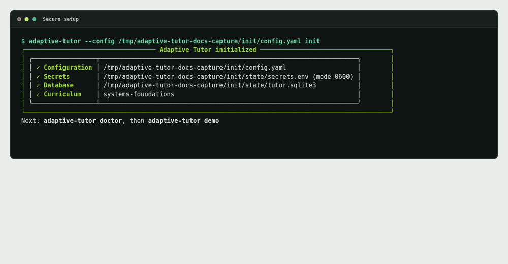
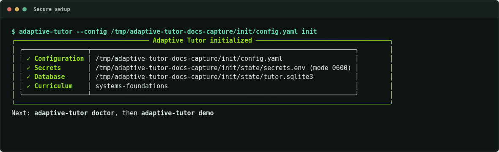
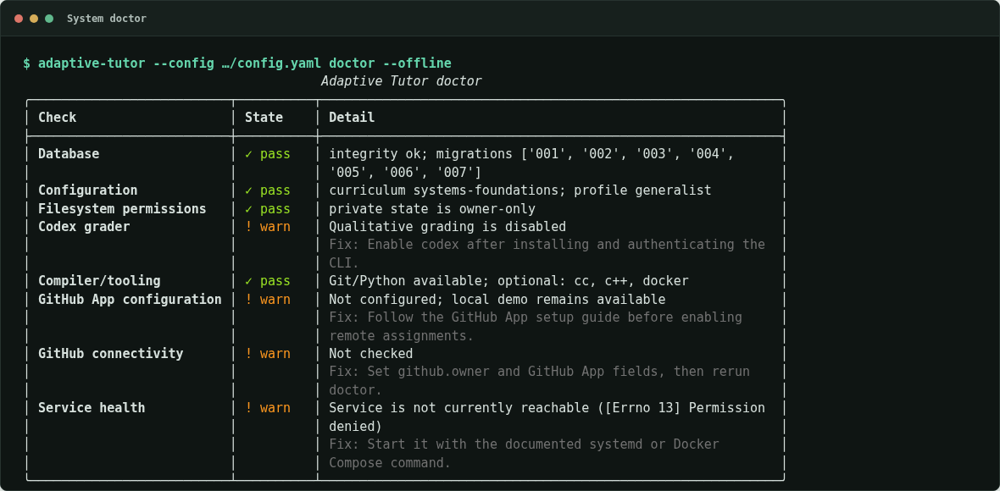
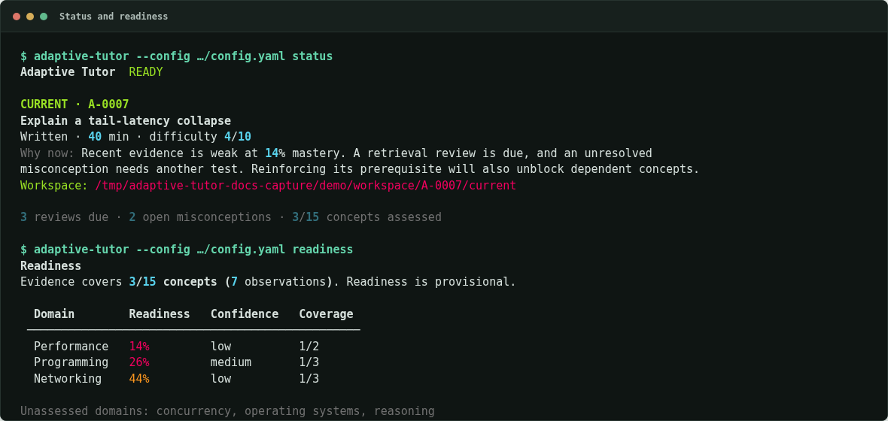
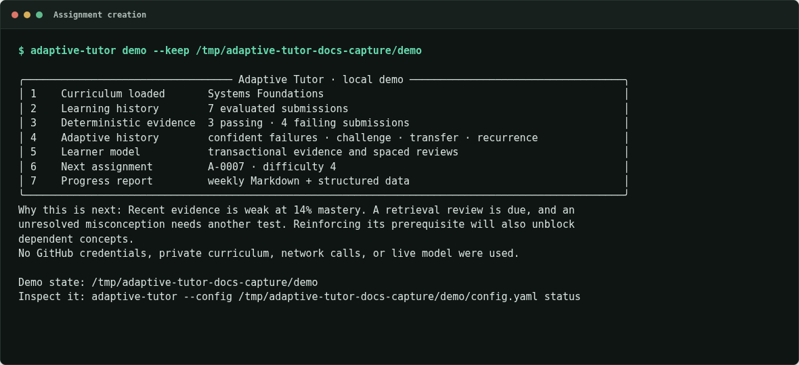
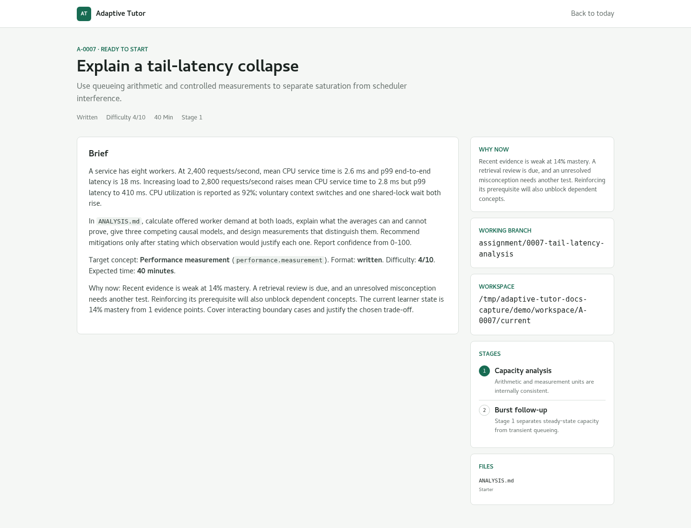
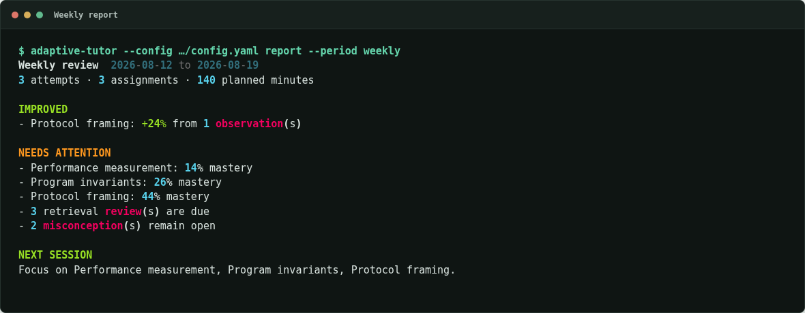
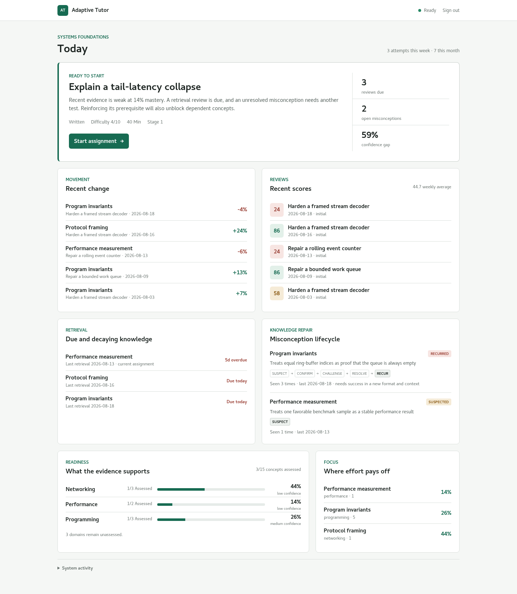
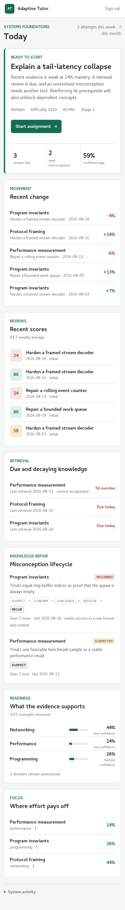

# Product tour

Every image on this page is generated by
`uv run --locked python scripts/capture-screenshots` from the real CLI, bundled
curriculum, SQLite state, templates, and CSS. The capture
environment removes credentials and network access from product commands. Asset
digests and the source-tree digest live beside the images in
`assets/screenshots/manifest.json`.

## Local learning loop

## Secure setup

## Doctor

## Status and readiness

## Assignment creation

The same generated assignment is available through the authenticated product
view, with learner-facing instructions and public files separated from trusted
reference and evaluator material.

## Weekly report

## Private dashboard

The seeded dashboard shows the same durable state as the CLI. Desktop and
mobile captures are generated in one browser session to exercise both layouts.

